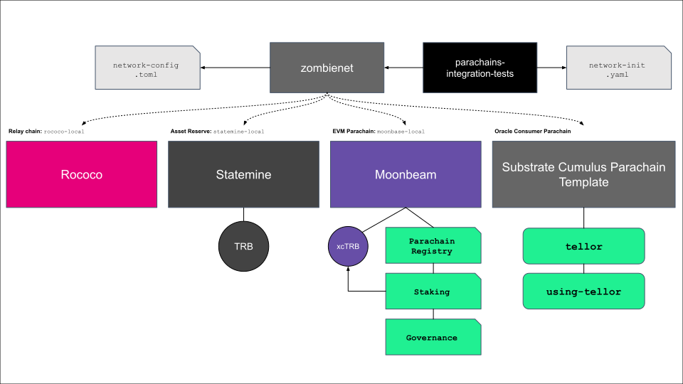

# Tellor
A proof-of-concept to assess XCM message sending between Tellor staking/governance smart contracts hosted on an 
EVM smart contract parachain and a `tellor` pallet on an oracle consumer parachain (OCP).

This code is cloned from [here](https://github.com/evilrobot-01/tellor).

## Components
The following diagram provides an overview of the various components used in the demo.



The following submodules are used:
- `cumulus`: using the `statemine-local` parachain runtime, as an asset reserve
- `moonbeam`: using the `moonbase-local` parachain runtime, hosting the Tellor smart contracts
- `polkadot`: relay chain using the `rococo-local` runtime
- `substrate-parachain-node`: parachain template acting as an oracle consumer chain with the following pallets:
  - [tellor](https://github.com/tellor-io/tellor-pallet): allows reporters to submit values in return for rewards, once staked via the staking contract
  - [using-tellor](https://github.com/tellor-io/using-tellor-pallet): sample showing access to oracle data from the `tellor` pallet via the `UsingTellor` trait
- `tellor-contracts`: parachain registry, staking and governance contracts

## Setup

### Prerequisites:
- Install required packages and Rust as per https://docs.substrate.io/install/
- Install Foundry as per https://getfoundry.sh/
- Install `yarn`
- Install `parachains-integration-tests` from [here](https://github.com/paritytech/parachains-integration-tests/tree/frank/additional-keypair-types) 
  - see https://github.com/paritytech/parachains-integration-tests/pull/85 and below for more details
- Clone this repository, making sure to initialise the submodules: `git clone --recursive https://github.com/tellor-io/tellor-parachain-demo`

### Build
Build the `polkadot` (relay chain), `polkadot-parachain` (asset reserve), `moonbeam` and `parachain-template-node` (oracle consumer parachain) binaries using the `build` script:
  ```
  ./scripts/build.sh
  ```
### Launch Network
**NOTE:** this currently requires a custom build of the `parachains-integration-tests` tool which adds support for Ethereum signing required by Moonbeam.
See https://github.com/paritytech/parachains-integration-tests/pull/85 for more details. The custom build can be installed globally by cloning the branch used for the PR and then using `yarn global add file:$PWD` to install.
This should be done before running the launch script until the PR is accepted.

Launch a local network (`rococo-local`, `statemine-local`, `moonbase-local` and consumer parachain (with Tellor pallet) using the `launch` script:
```
./scripts/launch.sh
```
The launch process should conclude with a summary of the various network nodes, along with hyperlinks to launch network explorers for monitoring and interacting with the chains.

### Deploy Contracts & Initialise Chain State
In a new terminal shell, use the `deploy` script to deploy the Tellor contracts to Moonbeam as well as perform required chain state initialisation:
```
./scripts/deploy.sh
```

## Usage
The following table provides an overview of the functionality available. Example calls can be found in the appendix, using either Foundry's `cast` using the [development addresses](https://github.com/PureStake/moonbeam#prefunded-development-addresses) to call the contracts or using https://polkadot.js.org/apps/?rpc=ws://127.0.0.1:9930#/explorer to submit extrinsics on the oracle consumer parachain.

O = Open to all, X = restricted by origin

| Action                                    | EVMP | OCP | Description                                                                                                         |
|-------------------------------------------|:----:|:---:|---------------------------------------------------------------------------------------------------------------------|
| Register                                  |  X   |  ←  | Registers the parachain with the solution contracts                                                                 |
| **Funding**                               |      |     |                                                                                                                     |
| [Tip](#create-tip)                        |      |  O  | Creates a tip to incentivize data reporting in parachain defined token                                              |
| [Setup Data Feed](#setup-data-feed)       |      |  O  | Creates a data feed for continuous data reporting                                                                   |
| [Fund Feed](#fund-feed)                   |      |  O  | Allows anyone to fund an existing feed                                                                              |
| **Staking**                               |      |     |                                                                                                                     |
| [Approve Transfer](#approve-transfer)     |  O   |     | Approves amount of TRB for transfer to the staking contract                                                         |
| [Deposit Stake](#deposit-stake)           |  →   |  X  | Stakes TRB into staking contract for parachain, notifying parachain which enables account to begin reporting        |
| [Request Withdrawal](#request-withdrawal) |  →   |  X  | Requests withdrawal of a stake amount for parachain (7 day lock period)                                             |
| [Withdraw Stake](#withdraw-stake)         |  →   |  X  | Withdrawal of a stake amount for parachain                                                                          |
| Slash Reporter                            |  →   |  X  | Slashes a reporter/staker (callable by governance contract only)                                                    |
| **Reporting**                             |      |     |                                                                                                                     |
| [Submit Value](#submit-value)             |      |  X  | Oracle data reported directly to oracle consumer parachain                                                          |
| Claim Onetime Tip                         |      |  X  | Allows reporter to claim a tip (after 12 hour dispute period)                                                       |
| Claim Tips                                |      |  X  | Allows reporter to claim a batch of tips (12 hour dispute period)                                                   |
| **Governance**                            |      |     |                                                                                                                     |
| [Begin Dispute](#begin-dispute)           |  X   |  ←  | Any user on OCP can begin dispute provided they pay the dispute fee, removes disputed value until dispute finalised |
| [Vote](#vote)                             |  X   |  ←  | Users/reporters vote on OCP before being sent to governance, where either solution stakeholders vote                | 
| Tally Votes                               |  →   |     | Tallies the votes (after 1 day) and notifies OCP                                                                    | 
| Execute Vote                              |  →   |     | Executes the vote once tallied and notifies OCP, which processes dispute fees based on result                       | 
| Deregister                                |  X   |  ←  | Deregisters the parachain from the solution contracts                                                               |

## Appendix

### Calls
The following calls can be used to interact with the solution:

#### Approve Transfer
Approves the transfer of 100 TRB for the staking contract (as Baltathar/Bob) on the EVM parachain:
```shell
cast send --private-key 0x8075991ce870b93a8870eca0c0f91913d12f47948ca0fd25b49c6fa7cdbeee8b \
  --rpc-url http://localhost:9921/ --legacy 0xFFFFFFFFC8BE577A279484431B9444687EC3D2AE \
  "approve(address,uint256)" 0x970951a12F975E6762482ACA81E57D5A2A4e73F4 100000000000000000000
```

#### Begin Dispute
A submitted value can now be disputed on the consumer parachain by connecting to https://polkadot.js.org/apps/?rpc=ws://127.0.0.1:9930#/extrinsics/decode and then pasting in the following hex-encoded call:
```
0x28091c8aff950685c2ed4bc3174f3472287b56d9517b9c948127319a09a7a36deac8000000000000000000
```
**Note:** You will need to determine the timestamp for a previously submitted value and then enter it before submitting the call. This can be obtained by querying the `Reports` storage item within the chain state of the pallet.
Click **Submission**, ensure that the selected account is **Bob** (as the only reporter) and then click **Submit Transaction** and then **Sign and Submit**.

#### Create Tip
Creates a 'tip' on the oracle consumer parachain to incentivize data reporting by connecting to https://polkadot.js.org/apps/?rpc=ws://127.0.0.1:9930#/extrinsics/decode and then pasting in the following hex-encoded call:
```
0x28051c8aff950685c2ed4bc3174f3472287b56d9517b9c948127319a09a7a36deac80010a5d4e800000000000000000000001468656c6c6f
```
Click **Submission**, ensure that the selected account is **Ferdie** and then click **Submit Transaction** and then **Sign and Submit**.

#### Deposit Stake
Deposits a new stake of 100 TRB into the staking contract (as Baltathar/Bob) for a particular oracle consumer parachain, which should then report the stake to the corresponding parachain so that the reporter can begin reporting:
```shell
cast send --private-key 0x8075991ce870b93a8870eca0c0f91913d12f47948ca0fd25b49c6fa7cdbeee8b \
  --rpc-url http://localhost:9921/ --legacy 0x970951a12F975E6762482ACA81E57D5A2A4e73F4 \
  "depositParachainStake(uint32,bytes,uint256)" 3000 0x8eaf04151687736326c9fea17e25fc5287613693c912909cb226aa4794f26a48 100000000000000000000
```
The second `bytes` parameter is the corresponding address of the reporter on the oracle consumer parachain.

#### Fund Feed
Funds an existing feed with tokens by connecting to https://polkadot.js.org/apps/?rpc=ws://127.0.0.1:9930#/extrinsics/decode and then pasting in the following hex-encoded call:
```
0x280300000000000000000000000000000000000000000000000000000000000000001c8aff950685c2ed4bc3174f3472287b56d9517b9c948127319a09a7a36deac800000000000000000000000000000000
```
Click **Submission**, ensure that the selected account is **Ferdie** and then click **Submit Transaction** and then **Sign and Submit**.


#### Request Withdrawal
Requests withdrawal of 50 TRB from the staking contract (as Baltathar/Bob) for a particular parachain, which should then report the stake withdrawal request to the corresponding parachain:
```shell
cast send --private-key 0x8075991ce870b93a8870eca0c0f91913d12f47948ca0fd25b49c6fa7cdbeee8b \
  --rpc-url http://localhost:9921/ --legacy 0x970951a12F975E6762482ACA81E57D5A2A4e73F4 \
  "requestParachainStakeWithdraw(uint32,uint256)" 3000 50000000000000000000
```

#### Setup Data Feed
Creates a data feed for recurring data reporting by connecting to https://polkadot.js.org/apps/?rpc=ws://127.0.0.1:9930#/extrinsics/decode and then pasting in the following hex-encoded call:

```
0x28041c8aff950685c2ed4bc3174f3472287b56d9517b9c948127319a09a7a36deac800e40b540200000000000000000000007cac426400000000580200000000000000000000000000000000000000000000000000000000000000001468656c6c6f0010a5d4e80000000000000000000000
```
Click **Submission**, ensure that the selected account is **Ferdie** and then click **Submit Transaction** and then **Sign and Submit**.


#### Submit Value
Submits a value on the oracle consumer parachain to have a claim to the tip by connecting to https://polkadot.js.org/apps/?rpc=ws://127.0.0.1:9930#/extrinsics/decode and then pasting in the following hex-encoded call:
```
0x28071c8aff950685c2ed4bc3174f3472287b56d9517b9c948127319a09a7a36deac8848081afeeaff0ed5cee7d05a21078399c2f56226b0cd5657062500cef4c4e736f85000000001468656c6c6f
```
Click **Submission**, ensure that the selected account is **Bob** (as stake deposited above) and then click **Submit Transaction** and then **Sign and Submit**.

#### Vote
A dispute can now be voted on by an oracle user/reporter on the consumer parachain by connecting to https://polkadot.js.org/apps/?rpc=ws://127.0.0.1:9930#/extrinsics/decode and then pasting in the following hex-encoded call:
```
0x280a000000000000000000000000000000000000000000000000000000000000000000
```
**Note:** You will need to determine the dispute identifier from the `tellor.NewDispute` event from the previous step and then enter it along with whether the caller supports or rejects the dispute before submitting the call.

Click **Submission**, select the corresponding user/report account and then click **Submit Transaction** and then **Sign and Submit**.

#### Withdraw Stake
Withdraws any stake amount (as Baltathar/Bob) which was previously requested for withdrawal for a particular parachain, which should then report the stake withdrawal to the corresponding parachain:
```shell
cast send --private-key 0x8075991ce870b93a8870eca0c0f91913d12f47948ca0fd25b49c6fa7cdbeee8b \
  --rpc-url http://localhost:9921/ --legacy 0x970951a12F975E6762482ACA81E57D5A2A4e73F4 \
  "withdrawParachainStake(uint32)" 3000
```